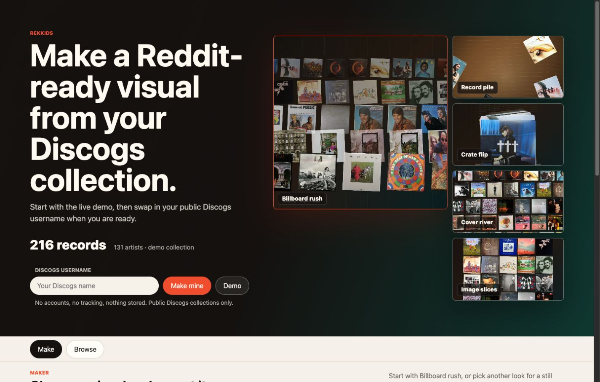
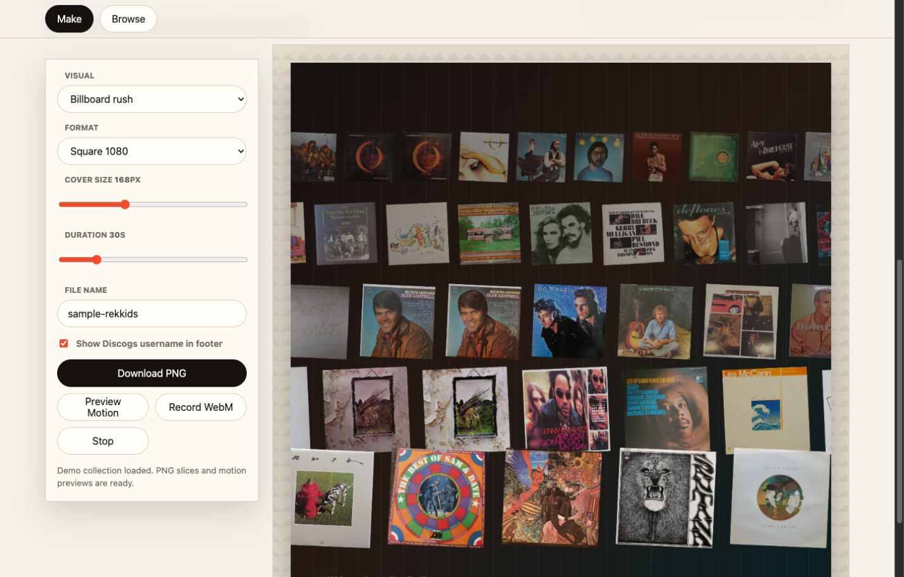

# Rekkids

Rekkids is a local-first Discogs collection visualizer. The name is a nod to the way a New Yorker might say "records": "let's spin some rekkids."

The project is aimed at vinyl communities where people want to share a collection without turning every cover into an unreadable thumbnail. The current prototype keeps the app static and uses local `collection.json` plus cached cover art in `covers/`.

## Screenshots

The homepage opens with a live demo and visual samples so visitors can see what Rekkids makes before entering a Discogs username.



The maker view pairs export controls with a live canvas preview for PNG and browser-recorded video output.



## What It Does Now

- Loads a local Discogs-derived collection from `collection.json`.
- Can fetch a public Discogs collection from a username in the UI or `?u=<discogs-username>`.
- Shows a sample-first maker homepage with live previews of the visual styles.
- Provides a maker UI with:
  - readable PNG slices that preserve cover size,
  - a Billboard Rush motion preview,
  - a texture-mapped Record Dungeon walkthrough,
  - a Cover River motion preview,
  - a Crate Flip motion preview,
  - a Record Pile motion preview,
  - Reddit-friendly MP4/H.264 recording when supported, with an honest client-side WebM fallback.
- Keeps a searchable/sortable Browse view for checking the loaded collection.

## Run Locally

Use a local server so the browser can fetch `collection.json`.

```bash
cd rekkids.xyz
python -m http.server 8000 --bind 127.0.0.1
```

Open:

```text
http://127.0.0.1:8000/
```

To load a public Discogs collection directly:

```text
http://127.0.0.1:8000/?u=<discogs-username>
```

If Discogs cannot be reached or the collection is private, the app falls back to the demo collection.

## Refresh Collection Data

The fetch script uses the Discogs API and expects a public or authenticated collection.

```bash
python -m venv .venv
source .venv/bin/activate
pip install -r requirements.txt
export DISCOGS_API_TOKEN="your-token-here"
python fetch_collection.py <discogs-username>
```

Useful variants:

```bash
python fetch_collection.py <discogs-username> --skip-download
python fetch_collection.py <discogs-username> --skip-fetch
```

## Design Direction

The main competition pattern is one giant collection grid. That works for small collections but fails as the collection grows because the covers become visual confetti.

Rekkids should instead optimize for:

- minimum readable cover size,
- static slices for large collections,
- moving visuals that use time instead of shrinking covers,
- Reddit-friendly square and vertical exports,
- eventual share pages that do not clobber the Discogs API.

## Remotion Later

The current motion prototypes use browser canvas recording so the site can stay static while the visual language evolves.

Remotion is a good next step once the visuals are worth hardening into deterministic server-rendered exports. Likely future compositions:

- `CoverRiver`
- `BillboardRush`
- `CrateFlip`
- `Starfield`

For a public `rekkids.xyz/?u=...` flow, avoid hitting Discogs on every page load. Fetch once, cache the snapshot, and serve generated assets from Rekkids.
